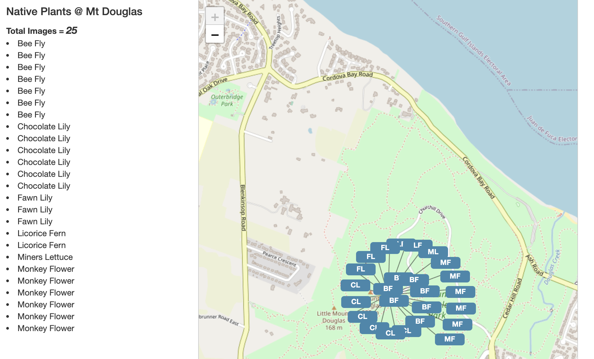
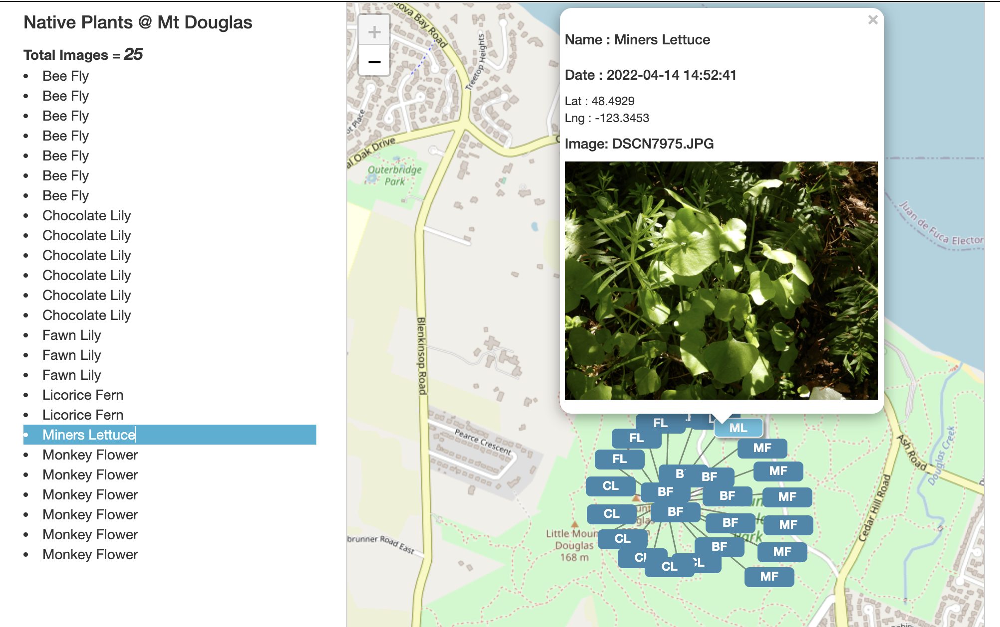

```{r setup, include=FALSE}
knitr::opts_chunk$set(echo = TRUE)
```

# Convert csv to json

# load library
```{r libraries}
library("jsonlite")
library("dplyr")
library("png")
```

# Data
## read csv
```{r read-data}
exif <- read.csv("./data/2022-04-14-MtDouglas-Exif.csv")
exif
```

### Rename columns
```{r rename-columns}
colnames(exif)

names(exif)[1] <- "Image"
names(exif)[2] <- "Date"
names(exif)[3] <- "Longitude"
names(exif)[4] <- "Latitude"
names(exif)[5] <- "Exposure"
names(exif)[6] <- "F-Stop"
names(exif)[7] <- "ISO"
names(exif)[8] <- "Focal"

colnames(exif)
```

### Add column
```{r add-column}
exif$Desc <- ""
exif$Name <- ""
exif$Location <- "Mt. Douglas"
str(exif)
```

---

## Convert Date to time format 
```{r convert-date-format}
exif$Date <- lubridate::ymd_hms(exif$Date, tz=Sys.timezone())
str(exif)
```

## add data to Name & Desc columns
```{r add-name-data}
head(exif)
exif_rows <- row.names(exif)
print(exif_rows)
str(exif_rows)

exif$Image

# try to name 2 rows at once >> using c()
exif[c("4", "5", "6", "7", "8", "9", "10"), "Name"] <- "Bee Fly" # 4-10
exif[c("11", "14", "17"), "Name"] <- "Fawn Lily" # 11, 14, 17
exif["13", "Name"] <- "Miners Lettuce" # 13
exif[c("15", "16"), "Name"] <- "Licorice Fern" # 15, 16
exif[c("18", "19", "20", "21", "39", "40"), "Name"] <- "Monkey Flower" # 18, 19, 20, 21
exif[c("26", "27", "27", "27", "30", "31", "32", "33"), "Name"] <- "Chocolate Lily" # 26, 27, 28, 29, 30, 31, 32, 33

exif[c("4", "5", "6", "7", "8", "9", "10"), "Desc"] <- "BF"  #"Bee Fly" # 4-10
exif[c("11", "14", "17"), "Desc"] <- "FL" # "Fawn Lily" # 11, 14, 17
exif["13", "Desc"] <- "ML" #"Miner's Lettuce" # 13
exif[c("15", "16"), "Desc"] <- "LF" #"Licorice Fern" # 15, 16
exif[c("18", "19", "20", "21", "39", "40"), "Desc"] <- "MF" # "Monkey Flower" # 18, 19, 20, 21
exif[c("26", "27", "27", "27", "30", "31", "32", "33"), "Desc"] <- "CL" #"Chocolate Lily" # 26, 27, 28, 29, 30, 31, 32, 33


exif_rows_list <- exif[, c("Image", "Name", "Desc")]
exif_rows_list
```

## Sort data by Image
```{r sort-name}
class(exif)
exif_sort <- exif[order(exif$Image, decreasing = FALSE), ]
```

# {jsonlite} create json object from all data
```{r jsonlite}
exif_json <- toJSON(exif_sort)
exif_json
class(exif_json)
```

## save all data as json file
```{r save-json-all}
write(exif_json, "./data/exif_json.json")
```


# remove rows without name, using dplyr, before creating json file
```{r remove-rows-na}
# https://stackoverflow.com/questions/9126840/delete-rows-with-blank-values-in-one-particular-column
class(exif_sort)
View(exif_sort)

# https://stackoverflow.com/questions/9126840/delete-rows-with-blank-values-in-one-particular-column
exif_sort_name_nona <- exif_sort[!(is.na(exif_sort$Name) | exif_sort$Name==""), ]

class(exif_sort_name_nona)
View(exif_sort_name_nona)
```

## Sort no NA data by Name before creating json file
```{r sort-name-na}
exif_sort_name_nona_sort <- exif_sort_name_nona[order(exif_sort_name_nona$Name, decreasing = FALSE), ]
exif_sort_name_nona_sort
class(exif_sort_name_nona_sort)
```


# {jsonlite} create json object from no NA's
```{r jsonlite-nonas}
exif_json_nona_sortname <- toJSON(exif_sort_name_nona_sort)
exif_json_nona_sortname
class(exif_json_nona_sortname)
```


## save na NA data as json file
copy the text from this file to html file
```{r save-json-nonas}
write(exif_json_nona_sortname, "./data/exif_json_nona_sort.json")
```

# HTML file for Leaflet map using json data
```{html}
<html lang="en">
	<head>
		<title>Leaflet Map - List Reference</title>
		<link rel="icon" href="https://people.geog.uvic.ca/wanthony/website/favicon.png">
		<meta name="viewport" content="width=device-width, initial-scale=1.0">
	    <meta charset="UTF-8">
	    <meta name="description" content="Leaflet Map - List Reference">
	    <meta name="keywords" content="Leaflet, Map, Test">
	    <meta name="author" content="Wendy Anthony">
	    <!-- code reference
	    	https://stackoverflow.com/questions/46302216/leaflet-trigger-event-on-clustered-marker-by-external-element

	    	https://jsfiddle.net/2gze75L6/6/
	     -->
	    <link rel="stylesheet" type="text/css" href="https://maxcdn.bootstrapcdn.com/bootstrap/3.3.7/css/bootstrap.min.css">
	    <link rel="stylesheet" type="text/css" href="https://cdnjs.cloudflare.com/ajax/libs/leaflet/1.2.0/leaflet.css">	
	    <link rel="stylesheet" type="text/css" href="https://leaflet.github.io/Leaflet.markercluster/dist/MarkerCluster.Default.css">	        
	    <link rel="stylesheet" type="text/css" href="https://leaflet.github.io/Leaflet.markercluster/dist/MarkerCluster.css">	        
	</head>
	<style type="text/css">
		#map {
			width: 800px;
			height: 1000px;
			border: 1px solid #ccc;	
		}
		#progress {
			display: none;
			position: absolute;
			z-index: 1000;
			left: 400px;
			top: 300px;
			width: 200px;
			height: 20px;
			margin-top: -20px;
			margin-left: -100px;
			background-color: #fff;
			background-color: rgba(255, 255, 255, 0.7);
			border-radius: 4px;
			padding: 2px;
		}
		#progress-bar {
		  width: 0;
		  height: 100%;
		  background-color: #76A6FC;
		  border-radius: 4px;
		}

		.prop-div-icon {
		  border-radius: 5px;
		  background-color: #3a87ad;
		  min-width: 50px;
		  min-height: 20px;
		  font-weight: bold;
		  color: white;
		  text-align: center;
		}

		.prop-div-icon-shadow {
		  top: -3px;
		  left: -3px;
		  border-radius: 5px;
		  background-color: #5bc0de;
		  border-color: #3a87ad;
		  border: 1px solid;
		  min-width: 50px;
		  min-height: 20px;
		  font-weight: bold;
		  color: white;
		  text-align: center;
		  box-shadow: 3px 3px 3px 0px rgba(125, 125, 125, 0.8);
		}

		.prop-li-item {
		  cursor: pointer;
		}
	</style>
<body>
	<div class="container">
		<div class="row">
			<div class="col-md-4">
				<div><h4>Native Plants @ Mt Douglas</h4>
					<strong>Total Images = <em><span style="font-size: larger;" id="totalData"></span></em></strong>
				</div>
				<div></div>
				<div id="list"></div>
			</div>
			<div class="col-md-8">
				<div id="map" style="max-width: 640px; max-height: 1280px;"></div>				
			</div>
		</div>
	</div>
	<script src="https://code.jquery.com/jquery-2.2.4.min.js"></script>
	<script src="https://maxcdn.bootstrapcdn.com/bootstrap/3.3.7/js/bootstrap.min.js"></script>
	<script src="https://cdnjs.cloudflare.com/ajax/libs/leaflet/1.2.0/leaflet.js"></script>
	<script src="https://cdnjs.cloudflare.com/ajax/libs/leaflet/1.2.0/leaflet-src.js"></script>	
	<script src="https://leaflet.github.io/Leaflet.markercluster/dist/leaflet.markercluster-src.js"></script>	 	
    <script type="text/javascript">
		var tiles = L.tileLayer('https://{s}.tile.openstreetmap.org/{z}/{x}/{y}.png', {
		  maxZoom: 15
		});
		var latlng = L.latLng(48.4926, -123.3453);
		var map = L.map('map', {
		  center: latlng,
		  layers: [tiles]
		});
		var markers = L.markerClusterGroup();
		var markersRef = {};

/* 
**** use json_mapping.Rmd file to create json data from folder of image files

>> **** if json data is sorted and doesn't contain any NA values in Name field
>> just copy 

>>> can't use Name that has oppostrophe e.g. Miner's Lettuce s/b Miners Lettuce


json data needs to have a hard return between values
> in json file search for },{ 
> make a hard return, and copy
> add this copied hard return after the , comma
> when copied into this code, the json values must turn yellow (in Sublime)
>>
>>
> each datapoint MUST have a Name
>>
>>
> Description Field is the label shown for marker
>>
 */

		var theDatax = [{"Image":"DSCN7965.JPG","Date":"2022-04-14 14:50:57","Longitude":-123.3453,"Latitude":48.4926,"Exposure":0.0025,"F-Stop":4.9,"ISO":125,"Focal":21.5,"Desc":"BF","Name":"Bee Fly","Location":"Mt. Douglas"},{"Image":"DSCN7966.JPG","Date":"2022-04-14 14:51:05","Longitude":-123.3452,"Latitude":48.4925,"Exposure":0.0025,"F-Stop":4.9,"ISO":125,"Focal":21.5,"Desc":"BF","Name":"Bee Fly","Location":"Mt. Douglas"},{"Image":"DSCN7967.JPG","Date":"2022-04-14 14:51:11","Longitude":-123.3452,"Latitude":48.4925,"Exposure":0.0025,"F-Stop":4.9,"ISO":125,"Focal":21.5,"Desc":"BF","Name":"Bee Fly","Location":"Mt. Douglas"},{"Image":"DSCN7968.JPG","Date":"2022-04-14 14:51:13","Longitude":-123.3452,"Latitude":48.4925,"Exposure":0.0025,"F-Stop":4.9,"ISO":125,"Focal":21.5,"Desc":"BF","Name":"Bee Fly","Location":"Mt. Douglas"},{"Image":"DSCN7969.JPG","Date":"2022-04-14 14:51:15","Longitude":-123.3452,"Latitude":48.4926,"Exposure":0.0025,"F-Stop":4.9,"ISO":125,"Focal":21.5,"Desc":"BF","Name":"Bee Fly","Location":"Mt. Douglas"},{"Image":"DSCN7970 copy.JPG","Date":"2022-04-14 14:51:16","Longitude":-123.3452,"Latitude":48.4926,"Exposure":0.0025,"F-Stop":4.9,"ISO":125,"Focal":21.5,"Desc":"BF","Name":"Bee Fly","Location":"Mt. Douglas"},{"Image":"DSCN7970.JPG","Date":"2022-04-14 14:51:16","Longitude":-123.3452,"Latitude":48.4926,"Exposure":0.0025,"F-Stop":4.9,"ISO":125,"Focal":21.5,"Desc":"BF","Name":"Bee Fly","Location":"Mt. Douglas"},{"Image":"DSCN7992.JPG","Date":"2022-04-14 14:57:21","Longitude":-123.3456,"Latitude":48.4932,"Exposure":0.025,"F-Stop":4.2,"ISO":125,"Focal":7.2,"Desc":"CL","Name":"Chocolate Lily","Location":"Mt. Douglas"},{"Image":"DSCN7999.JPG","Date":"2022-04-14 14:58:25","Longitude":-123.3457,"Latitude":48.4931,"Exposure":0.0167,"F-Stop":2.8,"ISO":125,"Focal":5.1,"Desc":"CL","Name":"Chocolate Lily","Location":"Mt. Douglas"},{"Image":"DSCN8004.JPG","Date":"2022-04-14 14:58:53","Longitude":-123.3456,"Latitude":48.493,"Exposure":0.02,"F-Stop":2.8,"ISO":125,"Focal":4.3,"Desc":"CL","Name":"Chocolate Lily","Location":"Mt. Douglas"},{"Image":"DSCN8005.JPG","Date":"2022-04-14 14:59:07","Longitude":-123.3456,"Latitude":48.4931,"Exposure":0.0167,"F-Stop":2.8,"ISO":125,"Focal":4.3,"Desc":"CL","Name":"Chocolate Lily","Location":"Mt. Douglas"},{"Image":"DSCN8006.JPG","Date":"2022-04-14 14:59:16","Longitude":-123.3456,"Latitude":48.4932,"Exposure":0.0167,"F-Stop":2.8,"ISO":125,"Focal":4.3,"Desc":"CL","Name":"Chocolate Lily","Location":"Mt. Douglas"},{"Image":"DSCN8007.JPG","Date":"2022-04-14 14:59:17","Longitude":-123.3456,"Latitude":48.4931,"Exposure":0.0167,"F-Stop":2.8,"ISO":125,"Focal":4.3,"Desc":"CL","Name":"Chocolate Lily","Location":"Mt. Douglas"},{"Image":"DSCN7971.JPG","Date":"2022-04-14 14:52:28","Longitude":-123.3454,"Latitude":48.4929,"Exposure":0.02,"F-Stop":4.2,"ISO":125,"Focal":7.2,"Desc":"FL","Name":"Fawn Lily","Location":"Mt. Douglas"},{"Image":"DSCN7977.JPG","Date":"2022-04-14 14:53:54","Longitude":-123.3454,"Latitude":48.4931,"Exposure":0.0125,"F-Stop":4.2,"ISO":125,"Focal":7.2,"Desc":"FL","Name":"Fawn Lily","Location":"Mt. Douglas"},{"Image":"DSCN7980.JPG","Date":"2022-04-14 14:54:42","Longitude":-123.3455,"Latitude":48.4931,"Exposure":0.008,"F-Stop":4.2,"ISO":125,"Focal":7.2,"Desc":"FL","Name":"Fawn Lily","Location":"Mt. Douglas"},{"Image":"DSCN7978.JPG","Date":"2022-04-14 14:54:26","Longitude":-123.3455,"Latitude":48.4931,"Exposure":0.002,"F-Stop":4.2,"ISO":125,"Focal":7.2,"Desc":"LF","Name":"Licorice Fern","Location":"Mt. Douglas"},{"Image":"DSCN7979.JPG","Date":"2022-04-14 14:54:29","Longitude":-123.3454,"Latitude":48.4931,"Exposure":0.01,"F-Stop":4.2,"ISO":125,"Focal":7.2,"Desc":"LF","Name":"Licorice Fern","Location":"Mt. Douglas"},{"Image":"DSCN7975.JPG","Date":"2022-04-14 14:52:41","Longitude":-123.3453,"Latitude":48.4929,"Exposure":0.008,"F-Stop":4.2,"ISO":125,"Focal":7.2,"Desc":"ML","Name":"Miners Lettuce","Location":"Mt. Douglas"},{"Image":"DSCN7982.JPG","Date":"2022-04-14 14:54:58","Longitude":-123.3456,"Latitude":48.4931,"Exposure":0.0167,"F-Stop":4.2,"ISO":125,"Focal":7.2,"Desc":"MF","Name":"Monkey Flower","Location":"Mt. Douglas"},{"Image":"DSCN7983.JPG","Date":"2022-04-14 14:55:04","Longitude":-123.3456,"Latitude":48.493,"Exposure":0.0333,"F-Stop":4.2,"ISO":125,"Focal":7.2,"Desc":"MF","Name":"Monkey Flower","Location":"Mt. Douglas"},{"Image":"DSCN7984.JPG","Date":"2022-04-14 14:55:09","Longitude":-123.3457,"Latitude":48.4932,"Exposure":0.0333,"F-Stop":4.2,"ISO":125,"Focal":7.2,"Desc":"MF","Name":"Monkey Flower","Location":"Mt. Douglas"},{"Image":"DSCN7985.JPG","Date":"2022-04-14 14:55:12","Longitude":-123.3457,"Latitude":48.4932,"Exposure":0.025,"F-Stop":4.2,"ISO":125,"Focal":7.2,"Desc":"MF","Name":"Monkey Flower","Location":"Mt. Douglas"},{"Image":"DSCN8014.JPG","Date":"2022-04-14 15:02:51","Longitude":-123.3458,"Latitude":48.4929,"Exposure":0.001,"F-Stop":2.8,"ISO":125,"Focal":4.3,"Desc":"MF","Name":"Monkey Flower","Location":"Mt. Douglas"},{"Image":"DSCN8017.JPG","Date":"2022-04-14 15:03:24","Longitude":-123.3458,"Latitude":48.4929,"Exposure":0.0008,"F-Stop":2.8,"ISO":125,"Focal":4.3,"Desc":"MF","Name":"Monkey Flower","Location":"Mt. Douglas"}]


		mapReload();

		function mapReload() {
		  // **Clear List**
		  var ul = document.getElementById("list");
		  ul.innerHTML = '';
		  updateMapMarkerResult(theDatax);
		  map.fitBounds(markers.getBounds());
		}

		function updateMapMarkerResult(data) {
		  markers.clearLayers();
		  for (var i = 0; i < data.length; i++) {
		    var a = data[i];
		    var myIcon = L.divIcon({
		      className: 'prop-div-icon',
		      html: a.Desc
		    });
		    var marker = L.marker(new L.LatLng(a.Latitude, a.Longitude), {
		      icon: myIcon
		    }, {
		      title: a.Name
		    });
		    marker.bindPopup('<div><div class="row"><h5>Name : ' + a.Name + '</h5></div><div class="row"><h5>Date : ' + a.Date + '</h5></div><div class="row">Lat : ' + a.Latitude + '</div><div class="row">Lng : ' + a.Longitude + '</div>' + '<div class="row"><h5>Image: ' + a.Image + '</h5>' + '</div>' + '</div>');
		    /*
'<div class="row"></div>' +
 +
*/
		    marker.on('mouseover', function(e) {
		      if (this._icon != null) {
		        this._icon.classList.remove("prop-div-icon");
		        this._icon.classList.add("prop-div-icon-shadow");
		      }
		    });
		    marker.on('mouseout', function(e) {
		      if (this._icon != null) {
		        this._icon.classList.remove("prop-div-icon-shadow");
		        this._icon.classList.add("prop-div-icon");
		      }
		    });
		    markersRef[a.Image] = marker;
		    markers.addLayer(marker);

		    updateMapListResult(a, i + 1);
		  }
		  map.addLayer(markers);
		}

		function updateMapListResult(data, totalData) {
		  var ul = document.getElementById("list");
		  var li = document.createElement("li");
		  li.setAttribute('marker', data.Image);
		  li.setAttribute('class', 'prop-li-item');
		  li.appendChild(document.createTextNode(data.Name));

		  // ** Event : Mouse Over **
		  li.addEventListener("mouseover", function(e) {
		    jQuery(this).addClass("btn-info");
		    //markersRef[this.getAttribute('marker')].fire('mouseover'); // --> Trigger Marker Event "mouseover"
		    var marker = markersRef[this.getAttribute('marker')];
		    _fireEventOnMarkerOrVisibleParentCluster(marker, 'mouseover');
		    // TODO : Trigger ClusteredMarker Event "mouseover"
		  });
		  // ** Event : Mouse Over **
		  li.addEventListener("mouseout", function(e) {
		    jQuery(this).removeClass("btn-info");
		    //markersRef[this.getAttribute('marker')].fire('mouseout'); // --> Trigger Marker Event "mouseout"
		    var marker = markersRef[this.getAttribute('marker')];
		    _fireEventOnMarkerOrVisibleParentCluster(marker, 'mouseout');
		    // TODO : Trigger ClusteredMarker Event "mouseout"
		  });
		  // ** Event : Click **
		  li.addEventListener("click", function(e) {
		    markersRef[this.getAttribute('marker')].fire('click');
		  });

		  ul.appendChild(li);

		  var spanTotalData = document.getElementById("totalData");
		  spanTotalData.innerHTML = totalData;
		}


		function _fireEventOnMarkerOrVisibleParentCluster(marker, eventName) {
		  if (eventName === 'mouseover') {
		    var visibleLayer = markers.getVisibleParent(marker);

		    if (visibleLayer instanceof L.MarkerCluster) {
		    	// We want to show a marker that is currently hidden in a cluster.
		      // Make sure it will get highlighted once revealed.
		      markers.once('spiderfied', function() {
		        marker.fire(eventName);
		      });
		      // Now spiderfy its containing cluster to reveal it.
		      // This will automatically unspiderfy other clusters.
		      visibleLayer.spiderfy();
		    } else {
		    	// The marker is already visible, unspiderfy other clusters if
		      // they do not contain the marker.
		    	_unspiderfyPreviousClusterIfNotParentOf(marker);
		      marker.fire(eventName);
		    }
		  } else {
		  	// For mouseout, marker is necessarily unclustered already.
		    marker.fire(eventName);
		  }
		}

		function _unspiderfyPreviousClusterIfNotParentOf(marker) {
			// Check if there is a currently spiderfied cluster.
		  // If so and it does not contain the marker, unspiderfy it.
		  var spiderfiedCluster = markers._spiderfied;

		  if (
		    spiderfiedCluster
		    && !_clusterContainsMarker(spiderfiedCluster, marker)
		  ) {
		    spiderfiedCluster.unspiderfy();
		  }
		}

		function _clusterContainsMarker(cluster, marker) {
		  var currentLayer = marker;

		  while (currentLayer && currentLayer !== cluster) {
		    currentLayer = currentLayer.__parent;
		  }

		  // Say if we found a cluster or nothing.
		  return !!currentLayer;
		}
    	
    </script>
</body>
</html>
```
## html leaflet map screenshots (embedded)


---



# Images of leaflet map webpage
## read png image with png library
```{r include-graphics-img1, fig.retina = 2, fig.cap="Leaflet map of Native Plant photos at Mt Douglas 2022-04-14", out.extra='style="background-color: #000000; padding:5px; display: inline-block;"'}
# http://zevross.com/blog/2017/06/19/tips-and-tricks-for-working-with-images-and-figures-in-r-markdown-documents/#style-your-image-environment-with-css
img1_path <- "images/Leaflet-Map-list-json.png"
img1 <- readPNG(img1_path, native = TRUE, info = TRUE)
attr(img1, "info") # dimensions: width and height in px

knitr::include_graphics(img1_path)
```

```{r include-graphics-img2, fig.retina = 2, fig.cap="Leaflet map, with open image, of Native Plant photos at Mt Douglas 2022-04-14", out.extra='style="background-color: #000000; padding:5px; display: inline-block;"'}
img2_path <- "images/Leaflet-Map-list-json-open.png"
img2 <- readPNG(img2_path, native = TRUE, info = TRUE)
attr(img2, "info")

knitr::include_graphics(img2_path)
```


